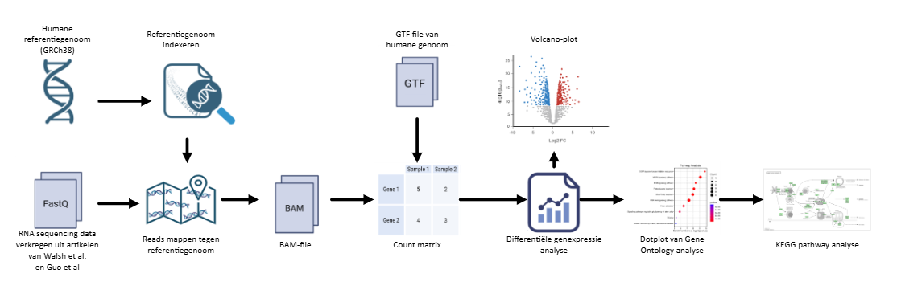
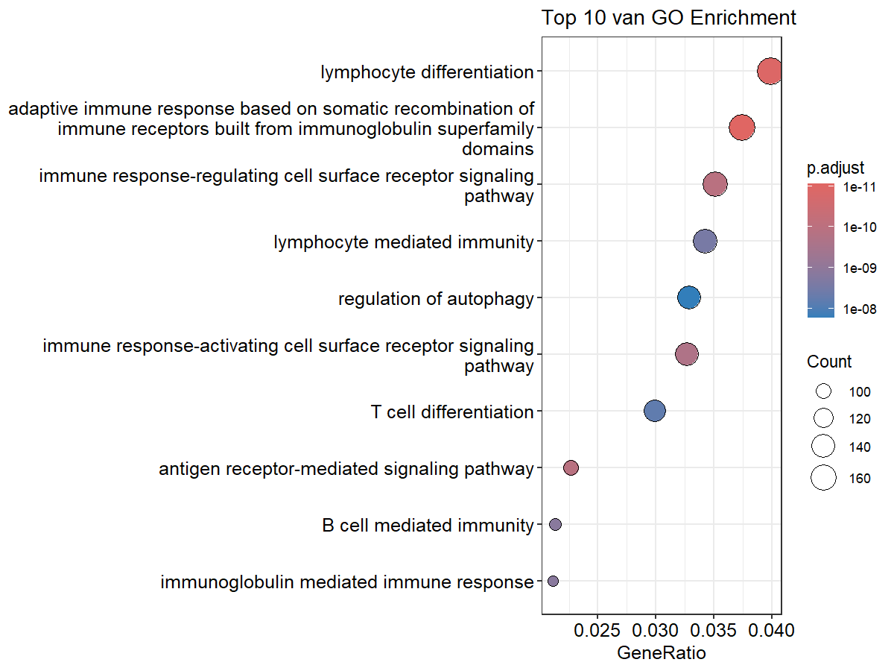
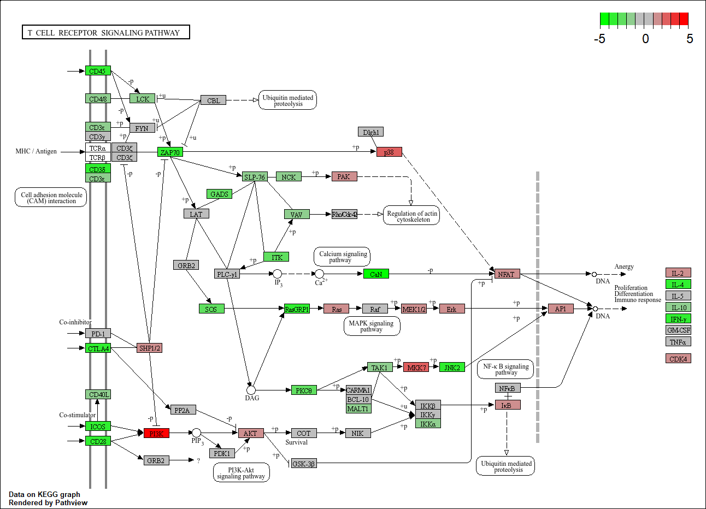
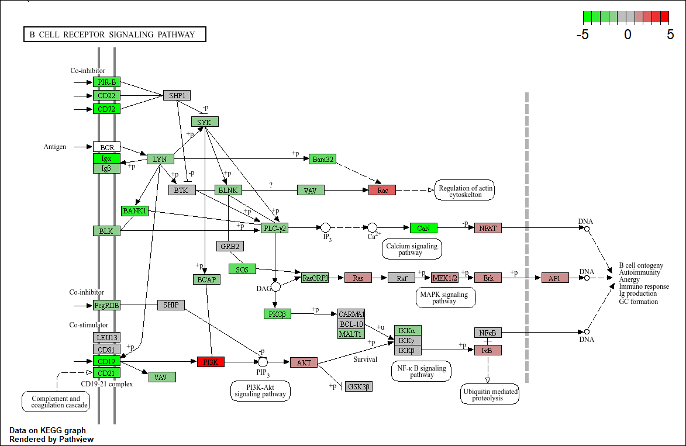

# Immuunregulerend pathway MAPK verantwoordelijk voor Reumatoïde atritis
## Structuur
AANVULLEN
- `Data_RA_raw` – Hierin staat de ruwe data waarmee deze transcriptomics analyse is gedaan
- `FLowschema` - Hierin staat het flowschema wat gebruikt is in de methode
-  `Resultaten` - Hierin staan de figuren die zijn gebruikt in de resultaten
- `Bronnen` - Hierin staan de bronnen die gebruikt zijn over het gehele verslag
- `script` – Hierin staat het script hoe de transcriptomics analyse is uitgevoerd
- `README.md` - Het document met het verslag er in

## Introductie
Reumatoïde artritis (RA) is een chronische auto-immuunziekte. Het afweersysteem ziet de gewrichten als lichaamsvreemd en valt ze aan. Hierdoor ontstaan ontstekingen in en rond de gewrichten. Vaak ontstaan deze ontstekingen in de pezen, slijmbeurzen of spieren, maar kunnen ook voorkomen in organen of andere weefsels buiten het gewricht (Reumatoïde Artritis (RA) | ReumaNederland, z.d.). De oorzaak van deze auto-immuunziekte is nog onbekend en hier wordt veel onderzoek naar gedaan. Momenteel is er bekend dat het geen erfelijke ziekte is. Wel zijn omgevingsfactoren belangrijk bij het ontstaan van RA (UMC Utrecht, z.d.). Vooral roken is een belangrijk risicofactor (Venken & Elewaut, 2025). Verder is er bekend dat bij Reumatoïde artritis er een ontregeling is in immuungerelateerde genen en pathways (Zhang et al., 2019). Ondanks deze resultaten is er naar Reumatoïde artritis nog veel onderzoek nodig. In dit onderzoek wordt, met behulp van transcriptomics, gekeken naar de expressie van genen in KEGG-pathways bij personen met Reumatoïde artritis. Hierbij is het doel de ziektemechanismen met de betrokken genen en pathways beter te analyseren en in kaart te brengen. 

## Methode

  

*Figuur 1. Flowschema.*

### Data verkrijgen
In dit onderzoek zijn 236 RNA sequencing synoviale biopten uit artikelen van Walsh et al. en Guo et al. gecombineerd tot 1 dataset. Voor het sequencen van het RNA is in beide artikelen Illumina gebruikt. De reads zijn geanalyseerd in R (R 4.5.3) doormiddel van een transcriptomics-analyse en opgeslagen in een [script](Script). 
### Primaire verwerking
Als eerst is BioManager versie 1.30.27 geïnstalleerd. Daarna zijn de reads gemapped tegen het [humane referentiegenoom versie hg38 (GRCh38)](https://www.ncbi.nlm.nih.gov/datasets/genome/GCF_000001405.40/ ) met Rsubread versie 2.24.0 en opgeslagen in BAM-files. Waarnaar er, door het humane referentiegenoom versie hg38 (GRCh38) in Gene Transfer Format (GTF) en de BAM-files te vergelijken, een Count matrix gemaakt met Rsubread versie 2.24.0. Vervolgens is hiervan een differentiële expressie-analyse uitgevoerd met DESeq2 versie 1.50.2 en gevisualiseerd in een Volcanoplot met EnhancedVolcano versie 1.28.2.
### Gene Ontrology analyse
Er is een Gene Ontology (GO) analyse gedaan op basis van een script op [MetwareBio](https://www.metwarebio.com/go-enrichment-analysis-clusterprofiler-guide/). Aanpassingen zijn gedaan met behulp van ChatGPT. Als eerst is er een GO-enrichment analyse gedaan met clusterProfiler versie 4.18.4. Hierbij is de P-waarde gecorrigeerd met de Benjamini-Hochenberg procedure. Genen werden als statistische significant beschouwd bij een gecorrigeerde P-waarde van < 0.05 en een q-waarde, False Discovery Rate gecorrigeerde P-waarde, van < 0.02. De top 10 hiervan is weergegeven in een dotplot met enrichplot versie 1.30.5.
### Data visualiseren
Uit het dotplot zijn KEGG-pathways gekozen die zijn geanalyseerd en visualiseert door de KEGG-pathway analyse met pathview versie 1.50.0. 

## Resultaten
In dit onderzoek is gekeken naar RNA sequenties van personen met en zonder reuma. Deze data is geanalyseerd doormiddel van een transcriptomics-analyse. Hierbij is een differentiële expressie-analyse uitgevoerd wat is gevisualiseerd in een volcanoplot. Daarna is een GO-analyse gedaan waaruit een dotplot is gemaakt. Tot slot zijn er KEGG pathways gekozen en gevisualiseerd, waaruit een aantal differentieel tot expressie gekomen genen gekozen en uitgelicht. 

In het figuur 2 is een Volcanoplot te zien. De rode punten zijn genen die binnen de beide grenswaarden vallen en dus significant differentieel tot expressie zijn gekomen. Hoe hoger het gen in de plot ligt, hoe significanter de expressie. Hoe verder het gen naar rechts ligt, hoe meer expressie deze vertoont. 

  

*Figuur 2. Volcano plot van differentiële expressie-analyse van patiënten met Reumatoïde artiritis ten opzichte van gezonde personen. Op de x-as is de log2 fold change weergegeven en op de y-as de -log10 P. De stippellijnen zijn de gestelde grenzen; een log2 fold change van -2 tot 2 en een -log10 p van > 5. De rode punten vallen binnen deze grenswaarden. De groene punten vallen alleen binnen de grenswaarden van de log2 fold change. De grijze punten vallen binnen geen van beide grenswaarden. De gelabelde genen worden in dit onderzoek verder besproken en dieper op in gegeaan.*

De resultaten van de GO-analyse zijn weergegeven in een dotplot in figuur 3. Hierin staat de top 10 meest significante biologische processen waarin meer differentieel geëxpresseerde genen in voorkomen dan verwacht wordt. Er is gekozen om de KEGG-pathways [“T cell receptor signaling pathway”] (https://www.kegg.jp/pathway/hsa04660) en [“B cell signaling pathway”] (https://www.kegg.jp/pathway/hsa04662) verder uit te zoeken. 

  

*Figuur 3. Dotplot van de top 10 meest significante 
biologische processen uit de GO-analyse. Op de y-as staan de biologische processen en op de x-as het gen ratio, of wel het aandeel genen dat bij het proces betrokken is. De kleur overgang geeft de p.adjust waarde weer, p-waarde gecorrigeerd met Benjamini-Hochenberg procedure. De grote van de bolletjes geeft het aantal genen weer dat binnen het biologische proces vallen.*

De pathways zijn geanalyseerd en weergegeven in de figuren 4 en 5. In beide figuren is het “MAPK signaling pathway” te zien. In beide pathways is te zien dat de genen Ras, MEK1/2 en Erk zijn upgereguleerd. In het figuur 4 is te zien dat ook het MKK7 gen sterk is upgereguleerd. 

  

*Figuur 4. KEGG pathway kaart van "T cell signaling pathway". De rood gekleurde genen zijn opgereguleerd en de groen gekleurde genen zijn neerwaarts gereguleerd ten opzichte van de controle groep.* 

  

*Figuur 5. KEGG pathway kaart van "B cell signaling pathway". De rood gekleurde genen zijn opgereguleerd en de groen gekleurde genen zijn neerwaarts gereguleerd ten opzichte van de controle groep.* 

## Conclusies
