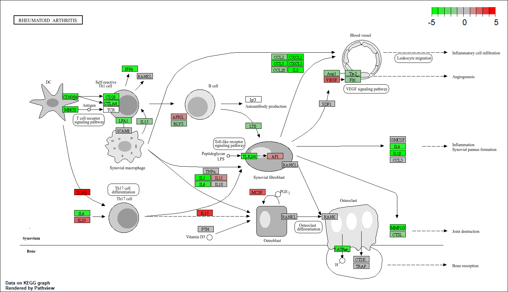

# Titel
## Structuur
AANVULLEN
- `Data_RA_raw` – Ruwe data waarmee deze transcriptomics analyse is gedaan
- `Bronnen` - Bronnen die voor dit onderzoek zijn gebruikt
- `script` – Hierin staat het script hoe de transcriptomics analyse is uitgevoerd
- `README.md` - Het document met het verslag er in

## Introductie
1 BRON TOEVOEGEN EN LOPEND VERHAAL VAN MAKEN
Reumatoïde artritis (RA) is een chronische auto-immuunziekte. Het afweersysteem ziet de gewrichten als lichaamsvreemd en valt ze aan. Hierdoor ontstaan ontstekingen in en rond de gewrichten. Vaak ontstaan deze ontstekingen in de pezen, slijmbeurzen of spieren, maar kunnen ook voorkomen in organen of andere weefsels buiten het gewricht (Reumatoïde Artritis (RA) | ReumaNederland, z.d.). De oorzaak van deze auto-immuunziekte is nog onbekend en hier wordt veel onderzoek naar gedaan. Momenteel is er bekend dat het geen erfelijke ziekte is. Wel zijn omgevingsfactoren belangrijk bij eht ontstaan van RA. Vooral roken is een belangrijk risicofactor (UMC Utrecht, z.d.). Er is verder bekend dat bij Reumatoïde artritis er een ontregeling is in immuungerelateerde genen en pathways (Zhang et al., 2019). Ondanks deze resultaten is er naar Reumatoïde artritis nog veel onderzoek nodig. In dit onderzoek wordt, met behulp van transcriptomics, gekeken naar de expressie van genen bij personen met Reumatoïde artritis. Hierbij is het doel de ziektemechanismen met de betrokken genen en pathways beter te analyseren en in kaart te brengen. 

## Methode
DOORLEZEN EN GOED LOPOEND MAKEN

  

### Data verkrijgen
In dit onderzoek zijn 236 RNA sequencing synoviale biopten uit artikelen van Walsh et al. en Guo et al. gecombineerd tot 1 dataset. Voor het sequencen van het RNA is in beide artikelen Illumina gebruikt. De reads zijn geanalyseerd in R (R 4.5.3) doormiddel van een transcriptomics analyse en opgeslagen in een [script](..). 
### Primaire verwerking
Als eerst is BioManager versie 1.30.27 geïnstalleerd. Daarna zijn de reads gemapped tegen het [humane referentiegenoom versie hg38 (GRCh38)](https://www.ncbi.nlm.nih.gov/datasets/genome/GCF_000001405.40/ ) met Rsubread versie 2.24.0. Hiervoor is eerst een index van het referentiegenoom gemaakt. De gemapte reads zijn opgeslagen in BAM-files. 
Daarna is er met behulp van een annotatiebestand in Gene Transfer Format (GTF) een read-telling uitgevoerd. Voor het referentiegenoom werd gebruikt gemaakt van hetzelfde humane referentiegenoom versie hg38 (GRCh38). Vervolgens is er met Rsubread versie 2.24.0 een Count matrix gemaakt door de BAM-files te vergelijken met het annotatiebestand. 
Daarna is hiervan een differentiële expressie-analyse uitgevoerd met DESeq2 versie 1.50.2. 
### Gene Ontrology analyse
De Gene Ontrology (GO) analyse is gedaan op basis van een script op [MetwareBio](https://www.metwarebio.com/go-enrichment-analysis-clusterprofiler-guide/). Aanpassingen zijn gedaan met behulp van ChatGPT. Als eerst is er een GO-enrichment analyse gedaan met clusterProfiler versie 4.18.4. Hierbij is de P-waarde gecorrigeerd met de Benjamini-Hochenberg procedure. Genen werden als statistische significant beschouwd bij een gecorrigeerde P-waarde van < 0.05 en een q-waarde, False Discovery Rate gecorrigeerde P-waarde, van < 0.02. De top 10 hiervan is weergegeven in een dotplot met enrichplot versie 1.30.5. 
### Data visualiseren
Uit het dotplot zijn KEGG-pathways gekozen die zijn geanalyseerd met KEGGREST versie 1.50.0 en gevisualiseerd met pathview versie 1.50.0. 
Tot slot is er een Volcanoplot gemaakt waarin de uitgezochte genen uit de verschillende pathways zijn gelabeld met EnhancedVolcano versie 1.28.2. 

## Resultaten

  

  

  

  

## Conclusies
